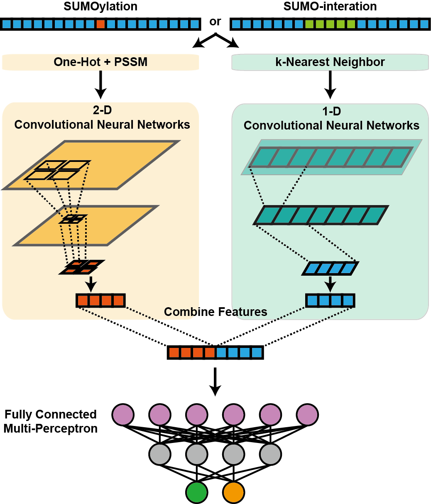

# DeepSumo
The best ever SUMOylation and SUMO-interaction prediction tool (201908)

## Contents

- [Introduction](#introduction)
- [Installation Guide and Dependency](#installation-guide)
- [Usage](#usage)
- [Example](#example)
- [Note](#note)
- [Contact](#contact)

<br>

<br>

## Introduction
#### Figure out potential SUMOylation sites or SUMO-interaction motifs
DeepSumo is specifically designed for finding potential SUMOylation sites or 
SUMO-interaction motifs in given sequences. With the combination of One-hot 
encode, PSSM encode and KNN encode methods and the application of convolutional 
neural networks, DeepSumo achieved a more accurate prediction comparing to that of 
the state-of-art tools. 



<br>

<br>

## Installation Guide and Dependency

Instead of installing the package on your system, users can simply run the package with commandline. 
<br>
Just pull or download these files to your computers or servers.
<br>
### Dependency
Python3
<br>
Python package: tensforflow; numpy
<br>
More details are shown in Usage.

<br>

<br>

## Usage
#### Basic command
'''
python predict_main.py [options]
'''
<br>
- **Mandatory parameters**

```
--t1
```

Threshold for the prediction of SUMOylation sites. This value could be either 
"low", "medium", "high" or "none". If it is set to "none", tool will not return SUMOylation prediction results.

```
--t2
```

Threshold for the prediction of SUMO-interaction motifs. This value could be either 
"low", "medium", "high" or "none". If it is set to "none", tool will not return SUMO-interaction prediction results.

```
-i
```

Input file that is in fasta format.

```
-o
```

The place you want to output the result and log file. The input should be a path not a filename.

<br>

<br>

## Example
python predict_main.py --t1 low --t2 low -i example/example.fasta -o example/

<br>

<br>

## Note
Some functions in our code has been deprecated by tensorflow but we can still use them. We will try to fix this later. Don't worry if FutureWarnings come up to you.

<br>

<br>

## Contact

If you have any questions or comments, please contact us.

<br>

**Jian Ren**

renjian.sysu@gmail.com

Professor of Bioinformatics

School of Life Sciences, Cancer Center, Sun Yat-sen University, Guangzhou 510060, China

<br>

**Zhixiang Zuo**

zuozhx@sysucc.org.cn

Associate Professor of Cancer Genomics

Cancer Center, Sun Yat-sen University, Guangzhou 510060, China

<br>

**Yubin Xie**

xieyb6@mail.sysu.edu.cn

Postdoc of Bioinformatics

School of Life Sciences, Sun Yat-sen University, Guangzhou 510060, China
